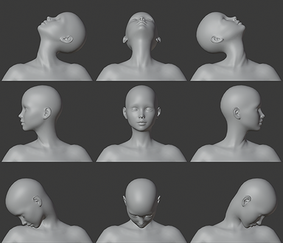
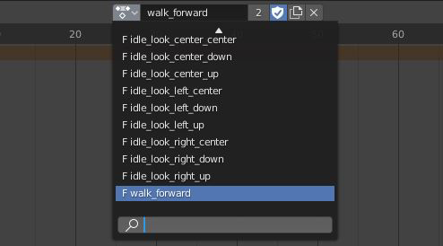
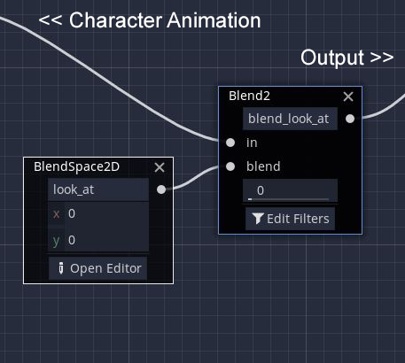
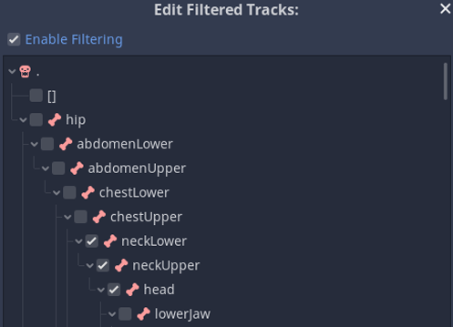
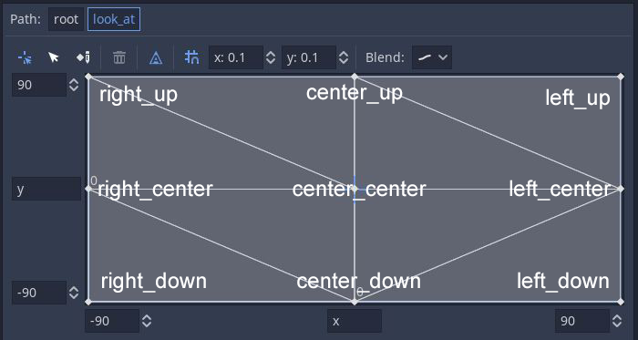
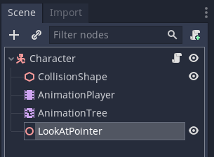

# Godot_3D_Character_LookAt_Guide

Guide how to implement 3D character LookAt behaviour inside the Godot Game Engine 3.2+

No longer updated.

# Content:

#### [1.) Step 1 -- Creating the head poses and animation tracks](#step-1----creating-the-head-poses-and-animation-tracks)
#### [2.) Step 2 -- Building the AnimationTree and Blendspace](#step-2----building-the-animationtree-and-blendspace)
#### [3.) Step 3 -- Scripting the lookat logic](#step-3----scripting-the-lookat-logic)
#### [4.) Common Issues](#common-issues)

If you need an example for lookat with direct bone manipulation you can find one inside the official Godot IK demo but this has a very high performance cost.

https://github.com/godotengine/godot-demo-projects/tree/master/3d/ik

# Step 1 -- Creating the head poses and animation tracks

First we need to create different headposes for our 3D character and import them as seperate animation tracks inside Godot.
We pose and keyframe the bone(s) of our character for each extreme look angle that we want to support, usually the neck and head bone(s).

There is no size-fits-all with the number of needed poses but for a common use case 9 poses are usually sufficient.
The example image shows the action list names inside Blender but you can name the tracks however you want.

Import the animation tracks to Godot and add them to your characters AnimationPlayer node.

Even if the tracks are frozen poses make sure they are also all looped tracks or the AnimationTree will have problems with blending.

# Step 2 -- Building the AnimationTree and Blendspace

Build your AnimationTree like normal but start with an AnimationBlendTree as Root Node (NOT an AnimationTreeStateMachine).

Inside the AnimationBlendTree you will have or create all the graph part that deals with your normal character animation and the final output node.

Between those parts add a Blend2 'blend_look_at' node and a Blendspace2D 'look_at' node and connect them like seen in the following image.

Inside the Blend2 'blend_look_at' node enable filtering and only check the bones that are affected by the lookat poses, e.g. neck and head bone(s).

Inside the Blendspace2d 'look_at' node set the range values for both x and y axis. We use the range values of -90 and 90 as the lookat angles in this example cause it works well with our models orientation.
After setting the range values add the prepared animation poses to the corners and center of the final blendspace like seen in the following image.

# Step 3 -- Scripting the lookat logic

Add a helper Spatial node as a child to your character node and name it 'LookAtPointer'. If your character node doesn't have a script already add one.

You can find the full GDScript file inside the 'src' folder as 'Character.gd'.

Inside the character script add the following block and customize the export variables.

    # sets the offset distance from the ground to your characters head, otherwise the angle will be calculated from the floor
    export(float) var character_height = 1.8

    # how fast the character can turn the head
    export(float) var head_turn_speed = 4.0
    
    # addition rotation degrees, use this with 180.0 if you have a +z forward oriented model e.g. Unity/DAZ
    export(float) var additional_rotation = 0.0

    # variable that holds our lookat target, if null resets/disables our lookat
    var _head_target

    # holds our animationtree node for the character
    onready var animation_tree : AnimationTree = get_node("AnimationTree")

    # a Spatial helper node used with Godot's look_at() function to get the rotation to the target without affecting the character
    onready var lookatpointer : Spatial = get_node("LookAtPointer")

    # function used from outside to give a target node to the lookat
    func start_lookat(_new_lookat_target : Spatial) -> void:
        _head_target = _new_lookat_target
            
        
    # function used from outside to stop the lookat and clear the target
    func stop_lookat() -> void:
        _head_target = null

        
    # default _process() to update the lookat each frame for a smooth movement as _physic_process() creates noticeable stutters at higher framerates
    func _process(delta):
        _process_lookat_animation(delta)

    
    func _process_lookat_animation(delta):
        # main lookat function to update the x and y values in our Blendspace2D with the new angles to the target

        # to avoid a sudden head movement when we start or stop the lookat we slowly increase/decrease the blend_amount of the 'blend_look_at' node
        if _head_target:
            animation_tree.set("parameters/blend_look_at/blend_amount", lerp(animation_tree.get("parameters/blend_look_at/blend_amount"), 1.0, delta))
        else:
            animation_tree.set("parameters/blend_look_at/blend_amount", lerp(animation_tree.get("parameters/blend_look_at/blend_amount"), 0.0, delta))
            # we have no target, no reason to run the rest of the code now
            return

        # move our helper pointer to the characters current height / head position
        lookatpointer.global_transform.origin.y = character_height
        
        # rotate the pointer node towards the target with Godot's build-in look_at() function
        lookatpointer.look_at(_head_target.get_global_transform().origin, Vector3.UP)
        
        #################################################################################  
        # What we now need is the correct characters horizontal and vertical angle towards the lookat target to feed the value in the Blendspace2D with our headposes.
        # The following code was made for -/+Z forward, +Y up, +X left orientation 3d models (e.g. Godot, Unity assets or DAZ imports). It needs adjustments for your character model if your orientation is different.
        # There are also parts marked as optional that are examples how to add a little flair to your characters movement behaviour but are not necessary.
        #################################################################################
    

        # vertical and horizontal rotation degrees (for more human-readable values compared to quats/radians) from our helper node
        var _horizontal_rotation_degrees : float = (lookatpointer.rotation_degrees.y) + additional_rotation
        var _vertical_rotation_degrees : float = (lookatpointer.rotation_degrees.x)
        
        var _look_x : float = _horizontal_rotation_degrees
        var _look_y : float = _vertical_rotation_degrees
        
        
        # optional - we flip values when target is behind the character for a cheap "overshoulder/eavesdrop" look without having dedicated animation poses for it
        if _horizontal_rotation_degrees > 180.0:
            _look_x = (360.0 - _look_x) * -1.0
        
        # we make sure the values stay inside the animation blendspace range
        _look_x = clamp(_look_x, -90.0, 90.0)
        _look_y = clamp(_look_y, -90.0, 90.0)

        # optional - behaviour modifications for different angels with interpolated values for smooth head movement
        if (_horizontal_rotation_degrees > 150.0 and _horizontal_rotation_degrees < 210.0):
            # optional - we are at a custom 'deadzone' angle behind (180°) our character
            if (_vertical_rotation_degrees > 70.0):
                # optional - if we are still behind the character but look down from the very top we want the character to look straight up
                _look_y = 90.0
                _look_x = animation_tree.get("parameters/look_at/blend_position").linear_interpolate( Vector2(0.0,_look_y), delta * head_turn_speed).x
                _look_y = animation_tree.get("parameters/look_at/blend_position").linear_interpolate( Vector2(0.0,_look_y), delta * head_turn_speed).y
            else:
                # optional - we are more or less directly behind the character, give the poor characters neck a break and reset the lookat to center/center position
                _look_x = animation_tree.get("parameters/look_at/blend_position").linear_interpolate( Vector2(0.0,0.0), delta * head_turn_speed).x
                _look_y = animation_tree.get("parameters/look_at/blend_position").linear_interpolate( Vector2(0.0,0.0), delta * head_turn_speed).y
        else:
            # default - we are in front or at a not to uncomfortable (neck breaking) angle behind the character so we use the full values
            _look_x = animation_tree.get("parameters/look_at/blend_position").linear_interpolate( Vector2(_look_x,_look_y), delta * head_turn_speed).x
            _look_y = animation_tree.get("parameters/look_at/blend_position").linear_interpolate( Vector2(_look_x,_look_y), delta * head_turn_speed).y
        
        # apply the new angle values to our blendspace2D x and y values
	animation_tree.set("parameters/look_at/blend_position", Vector2(_look_x, _look_y))

# Common Issues

### Animation is not playing

- Make sure there is a target node inside '_head_target' variable
- Make sure the animation tracks are looped or Godot will cancel the animationblend
- Make sure the paths to both 'blend_look_at' and 'look_at' node inside the AnimationBlendTree are correct

### The character looks in the wrong direction

- Make sure the animation tracks are correctly named
- Make sure the animation tracks are placed on the correct position inside the Blendspace2
- Make sure the (auto)created blendtriangles make sense inside the Blendspace2
- Make sure that the _horizontal_rotation_degrees and _vertical_rotation_degrees make sense for your models orientation and/or your Blendspace2D range values

### The character looks in the right direction but is very jumpy at certain angles
- Make sure your changed code makes sense, especially if you deal with negativ rotation values
- Make sure that you are not running into a gimbal lock e.g. switch to quats instead of degrees

